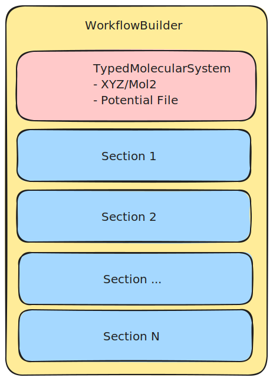
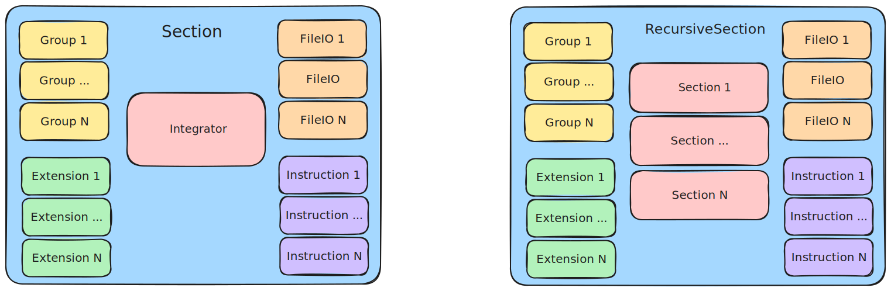

# Lammpy

## TLDR

LammpsInputBuilder (or LIB) is a Python library designed to generate Lammps inputs from a molecule file and a workflow high level definition.

The goal is to provide an API able to create a Lammps input and data scripts to declare a model followed by a sequence of operations. The current implementation supports ReaxFF and Rebo potentials for the model defintion, with the possibility to extend to other types of forcefields later on. 

Operations are organized in Sections, where each section is organized around typically but not necessary a time integration operations (minimize, nve, run 0, etc). Each Section can be extended to added addition computations (fix, compute, etc) running at the same time of the main time integration operation. 

With this organization, the main objectives of LammpsInputBuilder are as follows:
- Provide an easy way to generate base Lammps input scripts via a simple Python API
- Create a reusable library of common Sections types to easily chain common operations without having to copy Lammps code
- Make is possible for external tools to generate Lammps inputs via a JSON representation of a workflow (under construction)

## How does a Workflow work?

### Main Objects

A LammpsInputBuilder starts by declaring a `WorkflowBuilder` object. This object is responsible for hosting the workflow definition and converting it into a Lammps script.
The `WorkflowBuilder` is composed of two main parts: a `TypedMolecule`, and a list of `Section`.

A `TypedMolecule` represent a molecular model with a forcefield assigned to it. Currently, LIB supports ReaxFF and Airebo potentiels but other could be added in the future. With a `TypedMolecule`, the `WorkflowBuilder` can generate a Lammps data file as well as the beginning of the input script.

A `Section` generally represents a phase in a simulation workflow which could be reuse in another workflow. A `Section` can represent a minimization protocol, a NVE, a system warmup, etc. A `Section` can be recursive and be decomposed to another sequence of sub sections as well. A non recursive `Section` is often tied to a time integration process (minimize, nve, nvt), but certain `Section` can also be used as a way to modify the current state of the simulation, for instance to reset the timestep counter after a minimization or setup the velocity vectors of the atoms. 

A non recursive `Section` is usually built around an `Integrator` object. The `Integrator` object represents the process advancing the simulation. Current `Integrator` include the `MinimizeIntegrator`, `NVEIntegrator`, or `RunZeroIntegrator`, each of which are responsible to generate a `run` command in their execution. In addition to the `Integrator`, a `Section` can host a list of `Group`, `Extension`, and `FileIO` objects. A `Group` object represents a list of atoms selected based on different criteria. This object is a wrapper around the different Lammps offers to create atom selections. The `FileIO` objects are wrapper around the different methods that Lammps offer to write trajectory files during the time integration process. Finally, `Extension` objects are wrapper around different additionnal computations (`fix`, `compute`) which are being executed at the same time as the `Integrator`.

**Important**: A `Section` represents a scope for all the objects within it. The `Integrator`, `Group`, `Extension`, and `FileIO` objects assigned within the `Section` are declared at the start of the `Section` and but are also **removed** at the end of the `Section`. Consequently, if a following `Section` needs to use a `Group` previously declared, it will have to declare it again. This approach was chosen to enforce the clean deletion of every identifier during the execution of the Lammps script. Note that in the case of the `RecursiveSection`, the scope of the `Group`, `Extension`, and `FileIO` objects is visible to all the sub sections within the `RecursiveSection` and can thus be used by its sub sections.

### Unrolling the workflow into a Lammps script

TODO: 
- Unroll of Integrator
- Unroll of Extensions, FileIOs, Groups
- Unroll of Instruction
- Unroll of a Section

### Handling of Units 

TODO: 
- Goal: Make declaration of a workflow independant from the system definition unit
- Rely on Pint
- Make it easier to define quantities in a natural unit set and handle the necessary conversions internally 

## Workflow examples

### Minimize and NVE

TODO: Step by step description of the simpleNVE example.

### Scan of a surface with a tip

TODO: Step by step description of the scanSlab example.

